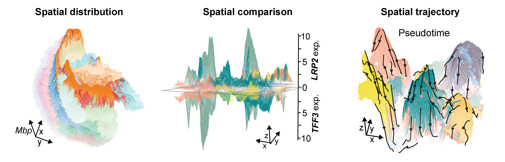

## Unravelling three-dimensionally dynamics of spatial multi-modal data with RidgeSpace

You can freely use RidgeSpace for illustrating, comparing, and tracking the spatial dynamics of molecular signals.

<p align="center">
  
</p>
<p align="center">
  Overview of RidgeSpace.
</p>

### Prerequisites

    "matplotlib", "numpy", "pandas", "scipy"

### Installation

I suggest that you can freely install RidgeSpace with pip. 

```bash
pip install RidgeSpace
```

You can also use a separate conda environment for installing RidgeSpace.

```bash
conda create -y -n RidgeSpace_env python=3.7
source activate RidgeSpace_env
pip install RidgeSpace
```

### Basic Examples

<p align="center">
  
</p>
<p align="center">
  Examples of RidgeSpace.
</p>

Test data and code for RidgeSpace provided in the "tests" folder.

Single-gene spatial depiction:
```bash
RidgeSpace.pl_single(adata, plot_name = 'Mbp', obs_cluster='Clusters', elev=40, view=160))
```

Multi-modal spatial comparison:
```bash
RidgeSpace.pl_multipleOUT(adata, plot_nameA = 'Tnnt1', plot_nameB = 'Tnnt2', obs_cluster='Clusters', elev=20, view=160, plot_HE_bg=True)
```

Pseudotime spatial trajectory representation:
```bash
RidgeSpace.pl_trajectory(adata, plot_name = 'Pseudotime', obs_cluster='Clusters', elev=45, view=165, HE_z=10)
```

Further tutorials please refer to  https://RidgeSpace.readthedocs.io/.
