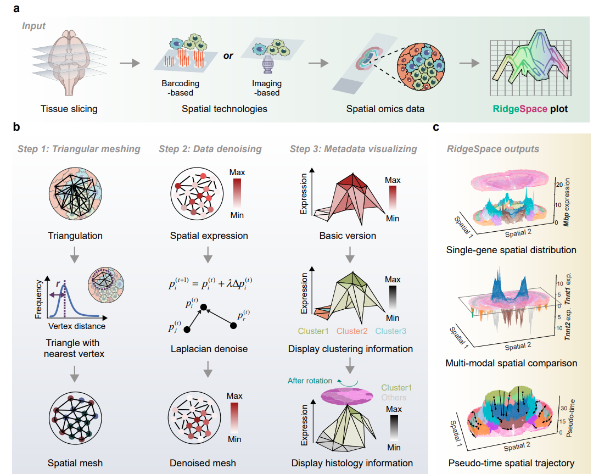

----------------------------------------------------------------------------------------------------------
Unravelling three-dimensionally dynamics of spatial multi-modal data with RidgeSpace
----------------------------------------------------------------------------------------------------------

You can freely use RidgeSpace for illustrating, comparing, and tracking the spatial dynamics of molecular signals.

Key applications of RidgeSpace
---------------------------------

+ Single-gene spatial depiction. 
+ Multi-modal spatial comparison. 
+ Pseudotime spatial trajectory representation. 

.. toctree::
   :caption: Main
   :maxdepth: 1
   :hidden:

   Installation
   Functions

.. toctree::
   :caption: Tutorials
   :maxdepth: 1
   :hidden:

   Single-gene spatial depiction
   Multi-modal spatial comparison
   Pseudotime spatial trajectory representation
   